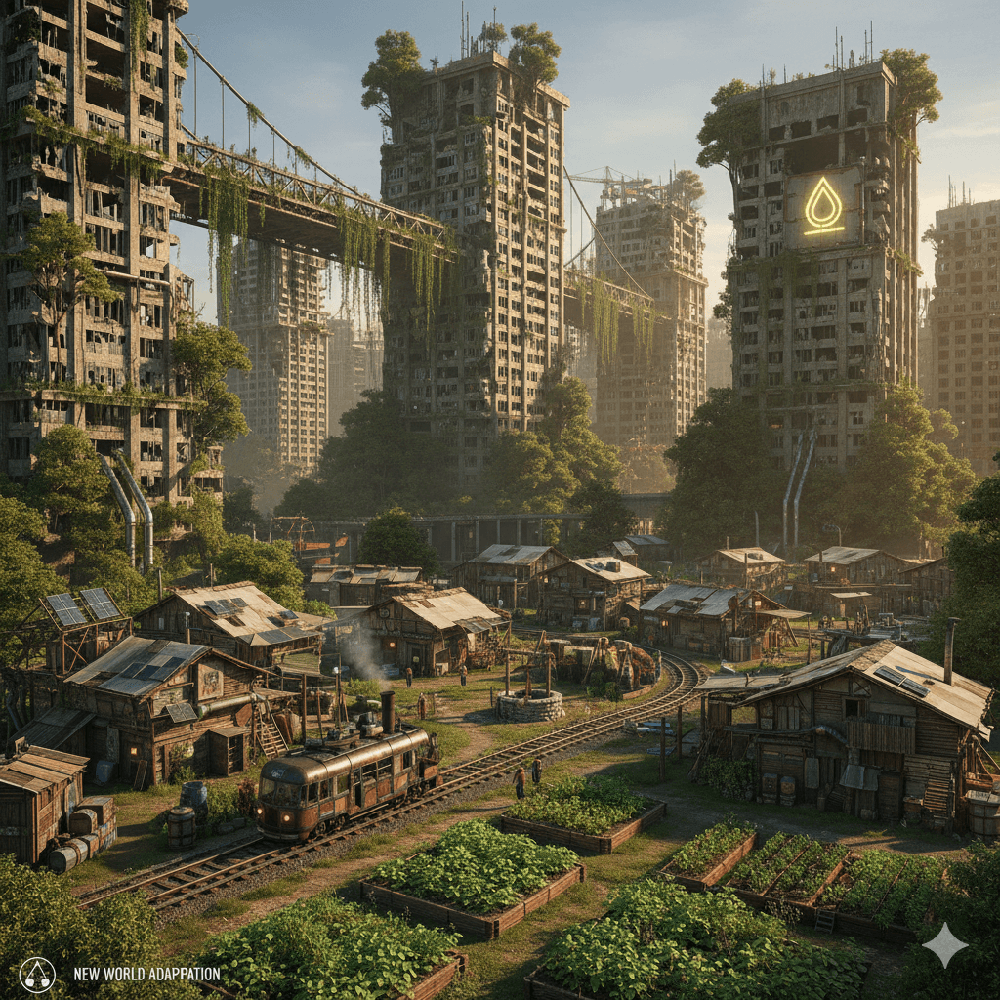

# The Reclamation Cycle

## A Post-Apocalyptic Logistics & Restoration Simulator

**Logline:** A post-apocalyptic **Logistics and Restoration Simulation** where the greatest challenge isn't surviving the collapse, but choosing the foundational principles—modern steel or sustainable wood—of the civilization you rebuild.

---

## The Core Concept

Decades after a world-ending event, humanity is ready to move beyond mere survival. The focus shifts from scavenging for basic necessities to a long-term vision of **regional revival**. The player manages an initial small settlement and must balance resource management, logistics, utility provision (water, power, sanitation), and defense to grow into a self-sustaining network of communities or a restored megapolis.

The heart of the gameplay is **choice and reclamation**. Every decision, from how to process scrap to what kind of infrastructure to build, defines the new civilization's future.

### Unique Selling Points (USPs)

1.  **The Reclamation Loop:** A deep, multi-tiered **recycling and upcycling mechanic**. Nearly every piece of "junk" from the old world can be disassembled, repaired, and re-forged into new materials. A wrecked car isn't just scrap metal; it's a source for engines, refined wiring, rubber, and glass shards.
2.  **Dual Reconstruction Path:** Players must choose between two comprehensive tech trees:
    * **Old World Path (Restoration):** Focuses on restoring high-efficiency, complex modern infrastructure (concrete, steel, deep pipes). *Pros: High density and efficiency. Cons: High maintenance and reliance on salvaged, non-renewable specialized components.*
    * **New World Path (Adaptation):** Focuses on local, sustainable materials (lumber, stone, bio-polymers) and low-tech solutions (tension-fabric buildings, composting). *Pros: Low maintenance and renewable resources. Cons: Lower density and production efficiency.*
3.  **Variable Apocalypse Scenarios:** High replayability driven by selectable world conditions that dramatically alter resource availability, available threats, and logistical challenges (e.g., a Fungal Contamination scenario vs. a Climate Catastrophe scenario).

---

## Core Gameplay Mechanics

### 1. Logistics and Utility Management

The movement and processing of resources is paramount.

* **Infrastructure:** Restore and build necessary utilities. Do you risk repairing the old, brittle high-volume pipes, or focus on a decentralized network of cisterns and wells?
* **Transport:** Establish efficient logistical chains using different technologies, from hand-carts and restored bicycles to narrow-gauge railways built from salvaged parts.
* **Basic Needs:** Managing the complex flows of clean water, sanitation, food production, and power generation for a growing population.

### 2. Settlement Progression (Phases of Growth)

The game progresses through three distinct scale milestones:

| Phase | Focus | Scale |
| :--- | :--- | :--- |
| **I. The Outpost** | Survival and Stability | Single small settlement; securing immediate salvage sites. |
| **II. The Town** | Logistics and Specialization | Multiple settlements/outposts connected by established resource routes (e.g., rail line); solidifying the "Old World" or "New World" path. |
| **III. The Network** | Restoration and Grand Project | The final goal: restoring a massive piece of Old World infrastructure (e.g., a hydro dam or data center) or building a comprehensive, resilient network of self-sustaining cities. |

### 3. Conflict (Optional)

Conflict is not the primary focus but an integral part of high-stakes resource retrieval.

* **Expeditions:** Combat is typically mission-based, involving **tactical defense** of crew members while they retrieve high-value salvage from dangerous zones (raider camps, highly infected areas, etc.).
* **Peaceful Mode:** An optional setting to remove external threats entirely, allowing the player to focus purely on the logistical and restoration challenge.

---

## Getting Started

This repository will serve as the central hub for design, documentation, and asset tracking.

* Check the **DOCS/** folder for detailed design outlines and scenario specs.

---

> 🖼️ This repository includes a social preview image for enhanced link sharing.